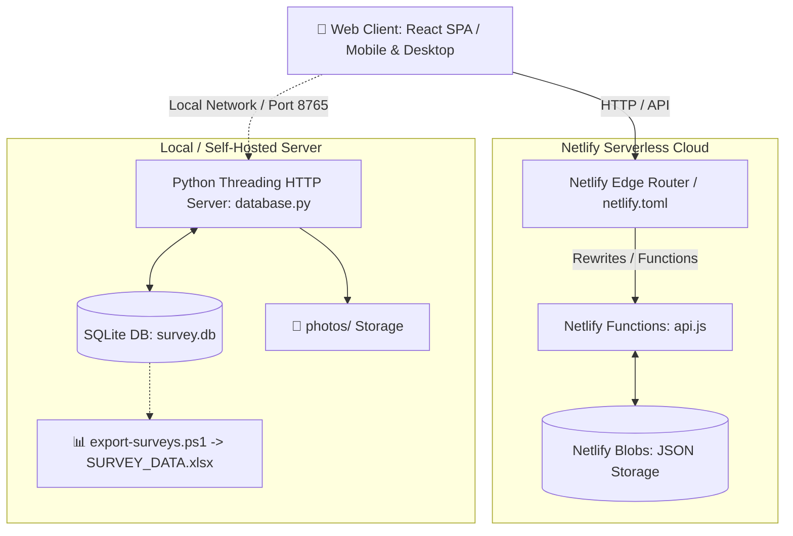

# NBTC Microwave — Pre-PM (Pre-Preventive Maintenance) Survey Control Room

[](https://www.netlify.com/)


ระบบศูนย์ควบคุมและบันทึกข้อมูลการเข้าตรวจเยี่ยมเจ้าของพื้นที่สำหรับงานบำรุงรักษาเชิงป้องกันล่วงหน้า (Pre-Preventive Maintenance) สถานีวิทยุคมนาคม NBTC Microwave

---

## 📋 ภาพรวมโครงการ (Project Overview)

**Pre-PM Survey Control Room** ได้รับการออกแบบขึ้นมาเพื่ออำนวยความสะดวกให้แก่วิศวกรและช่างเทคนิคภาคสนามในการลงพื้นที่สำรวจสถานีวิทยุคมนาคม (NBTC Microwave) โดยครอบคลุมตั้งแต่การตรวจสอบสิทธิ์การเข้าพื้นที่ บันทึกสภาพอุปกรณ์ ตรวจสอบระบบสื่อสาร ระบบไฟฟ้า เสาอากาศ ตลอดจนการถ่ายภาพและสรุปผล เพื่อส่งข้อมูลเข้าสู่ส่วนกลางแบบเรียลไทม์

ระบบรองรับทั้งการรันแบบ **Standalone / On-Premises (Python + SQLite)** และแบบ **Cloud Serverless (Netlify Functions + Netlify Blobs)** พร้อมหน้าต่างควบคุม (Control Room Dashboard) สไตล์ Glassmorphism ที่ทันสมัยและตอบสนองได้ทุกอุปกรณ์ (Desktop, Tablet, Mobile)

---

## ✨ ฟีเจอร์หลัก (Key Features)

### 1. 📊 Survey Control Room Dashboard (ศูนย์ควบคุมงานสำรวจ)
- **Live Statistics**: สรุปตัวเลขผลสำรวจรวม, จำนวนสถานีทั้งหมดในฐานข้อมูล, สถิติการได้รับอนุญาต / ไม่อนุญาตเข้าพื้นที่
- **Provincial Heatmap / Bar Chart**: กราฟแสดงสถิติการสำรวจแยกตามจังหวัดแบบเรียลไทม์
- **Recent Survey Activity Table**: ตารางแสดงรายการสำรวจล่าสุด พร้อมผลการอนุญาตและเวลาที่บันทึก
- **Auto-polling**: อัปเดตข้อมูลอัตโนมัติทุก 30 วินาที

### 2. 📝 Field Visit / Site Record (แบบบันทึกการเข้าตรวจเยี่ยม)
- **01 ข้อมูลสถานี (Station Info)**: ดึงรายชื่อสถานีและสถานที่ติดตั้งจากฐานข้อมูล (`DATABASE.xlsx`) แบบ Datalist Auto-complete
- **02 ผู้ให้ข้อมูลในพื้นที่ (Local Informant)**: บันทึกชื่อ, ตำแหน่ง, หน่วยงาน/หมู่บ้าน และเบอร์โทรศัพท์ติดต่อ
- **03 การขออนุญาตเข้าพื้นที่ (Site Access Permit)**: ระบุผลการขออนุญาต (อนุญาต/ไม่อนุญาต) และข้อจำกัดในการเข้าพื้นที่
- **04 สอบถามการใช้งาน (Radio & Power Status)**: ประเมินการใช้งานเครื่องวิทยุ, ปัญหาการรับ/ส่งสัญญาณ, ปัญหาระบบไฟฟ้า และระบบแบตเตอรี่สำรอง
- **05 สภาพแวดล้อมหน้างาน (Site Environment)**: บันทึกสภาพตู้ติดตั้งอุปกรณ์, สภาพเสาและสายอากาศที่มองเห็นได้จากพื้นดิน, อุปสรรคในการปฏิบัติงาน
- **06 ภาพถ่ายก่อนดำเนินงาน (Photo Documentation)**: อัปโหลดและบันทึกภาพถ่ายหน้างานหลายไฟล์พร้อมกัน
- **07 ยืนยันข้อมูล (Sign-off & Confirmation)**: สรุปสิ่งที่ได้รับแจ้ง พร้อมบันทึกชื่อผู้ให้ข้อมูลและช่างผู้ปฏิบัติงาน

### 3. 🔐 ความปลอดภัยและการเข้าถึง (Security & Access Control)
- ระบบล็อกอินด้วยรหัสผ่านผ่าน Token-based Authentication (HMAC SHA-256)
- ป้องกันการเข้าถึงไฟล์ข้อมูลสำคัญทาง URL โดยตรง (ตั้งค่า 404 Rewrite สำหรับ `access-password.txt`, `DATABASE.xlsx`, `survey.db`, `SURVEY_DATA.xlsx`)
- รองรับการตั้งรหัสผ่านผ่านไฟล์ `access-password.txt` หรือ Environment Variable `FORM_PASSWORD`

---

## 🏗️ โครงสร้างสถาปัตยกรรม (Architecture)



---

## 📁 โครงสร้างโปรเจกต์ (Project Structure)

```text
Pre-PM/
├── assets/
│   └── icons/                 # ไอคอน SVG สำหรับ Dashboard และ Navigation
├── netlify/
│   └── functions/
│       └── api.js             # Netlify Serverless Backend API (Blobs + XLSX)
├── .gitignore                 # ตั้งค่า Ignore ไฟล์ชั่วคราว, DB, และ node_modules
├── access-password.txt        # รหัสผ่านเริ่มต้นสำหรับเข้าสู่ระบบ
├── DATABASE.xlsx              # ฐานข้อมูลสถานีหลัก (Master Station Records)
├── database.py                # เซิร์ฟเวอร์ Python สำหรับรันแบบ Local / Dedicated
├── export-surveys.ps1         # สคริปต์ส่งออกข้อมูลแบบสำรวจเป็น Excel (SURVEY_DATA.xlsx)
├── index.html                 # หน้าเว็บหลัก React 18 SPA (Dashboard + Field Form)
├── netlify.toml               # การตั้งค่า Build, Redirects และ Security Rules สำหรับ Netlify
├── package.json               # Node.js dependencies (@netlify/blobs, xlsx)
├── package-lock.json          # Dependency lockfile
├── requirements.txt           # Python dependencies (สำหรับ Render / Cloud deployment)
├── server.ps1                 # สคริปต์ PowerShell สำหรับรัน Local Server อัตโนมัติ
└── README.md                  # เอกสารคู่มือโครงการ
```

---

## 🚀 การติดตั้งและใช้งาน (Getting Started)

### วิธีที่ 1: รันบนเครื่อง Local ด้วย PowerShell (Windows)

1. ดับเบิลคลิกหรือรันสคริปต์ [server.ps1](file:///d:/Users/utai3/OneDrive%20-%20FORTH%20CORPORATION%20PUBLIC%20COMPANY%20LIMITED/NBTC%20Microwave/Coding/FIXED/server.ps1) ผ่าน PowerShell:
   ```powershell
   .\server.ps1
   ```
2. ระบบจะทำการตรวจสอบ Python อัตโนมัติ และเปิดเบราว์เซอร์ไปยัง `http://localhost:8765`
3. เข้าสู่ระบบด้วยรหัสผ่านใน [access-password.txt](file:///d:/Users/utai3/OneDrive%20-%20FORTH%20CORPORATION%20PUBLIC%20COMPANY%20LIMITED/NBTC%20Microwave/Coding/FIXED/access-password.txt)

---

### วิธีที่ 2: รันผ่าน Python โดยตรง

```bash
# รันเซิร์ฟเวอร์บนพอร์ตเริ่มต้น (8765) หรือระบุพอร์ตด้วย PORT=8080
python database.py
```

---

### วิธีที่ 3: Deploy สู่ Netlify (Cloud Serverless)

1. เชื่อมต่อ Git Repository เข้ากับบัญชี [Netlify](https://www.netlify.com/)
2. ระบบจะอ่านการตั้งค่าจาก [netlify.toml](file:///d:/Users/utai3/OneDrive%20-%20FORTH%20CORPORATION%20PUBLIC%20COMPANY%20LIMITED/NBTC%20Microwave/Coding/FIXED/netlify.toml) อัตโนมัติ:
   - **Publish directory**: `.`
   - **Functions directory**: `netlify/functions`
3. ตั้งค่า Environment Variables บน Netlify (Site settings > Environment variables):
   - `FORM_PASSWORD`: *(กำหนดรหัสผ่านสำหรับเข้าสู่ระบบ)*
4. กด **Deploy site** — ใช้งานได้ทันทีพร้อมพื้นที่จัดเก็บข้อมูลบน Netlify Blobs

---

## 📊 การส่งออกข้อมูลเป็น Excel (Export Data)

เมื่อมีการบันทึกผลสำรวจในระบบ Local สามารถรันสคริปต์ส่งออกข้อมูลเป็นไฟล์ Excel รายงานผล:

```powershell
.\export-surveys.ps1
```

ไฟล์รายงาน `SURVEY_DATA.xlsx` จะถูกสร้างขึ้นมาโดยอัตโนมัติ ประกอบด้วย:
1. **Sheet: SurveyData** — ข้อมูลรายการสำรวจพร้อมฟิลด์ครบถ้วนทุกข้อ
2. **Sheet: Dashboard** — สรุปภาพรวมยอดสำรวจ และจำนวนการลงพื้นที่แยกตามจังหวัด

---

## 🔒 ข้อควรระวังและสิทธิ์การใช้งาน (Security & Operational Notes)

- **รหัสผ่าน**: สำหรับ Production ขอแนะนำให้เปลี่ยนรหัสผ่านใน `access-password.txt` หรือกำหนดผ่านตัวแปรสภาพแวดล้อม `FORM_PASSWORD`
- **ไฟล์ข้อมูล**: ไฟล์ `.gitignore` ถูกกำหนดค่าไว้เพื่อป้องกันการ Commit ข้อมูลส่วนบุคคล (เช่น รูปถ่ายหน้างาน `photos/`, ฐานข้อมูล `survey.db`, และไฟล์สำรอง `backups/`) ขึ้น Git โดยไม่ตั้งใจ

---

## 👨‍💻 พัฒนาโดย (Maintained By)

- **Project**: NBTC Microwave Field Survey & Control Room System
- **Repository**: [https://github.com/Thaidimaru/Pre-PM](https://github.com/Thaidimaru/Pre-PM.git)